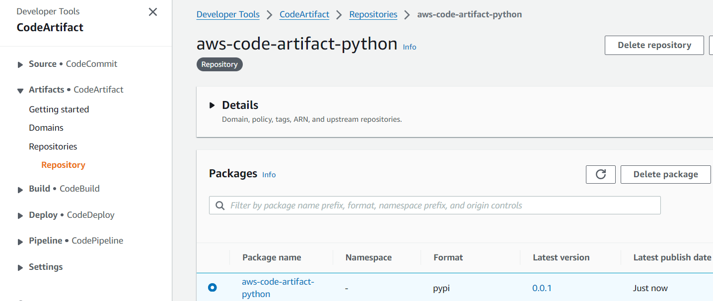

# AWS Code Artifact | Python

[](https://github.com/mel-cdn/azure-fastapi-serverless/actions/workflows/deploy.yml)
[](https://opensource.org/licenses/MIT)

Little project to explore pushing and pulling a Python libray to AWS Code Artifact.

## Requirements

1. Install [pyenv](https://github.com/pyenv/pyenv#installation)
2. Install [Poetry](https://python-poetry.org/docs/)
3. Install [AWS CLI V2](https://aws.amazon.com/cli/)


## Setup the project

```bash
# Clone project
$ git clone https://github.com/mel-cdn/aws-code-artifact-python.git
$ cd aws-code-artifact-python

# Setup Python environment
$ pyenv install 3.12.3
$ poetry env use python3.12
$ poetry shell
$ poetry env info
$ poetry install

# Test Python environment
$ pytest --cov=shared
```

## Setup Code Artifact Domain and Repository

1. Create a domain if you don't have one yet. For console or CLI guide, see
   details [here](https://docs.aws.amazon.com/codeartifact/latest/ug/domain-create.html).
   <details>
   <summary>Domain (click to view)</summary>
   
   
   
   </details>


2. Create a repository under the domain. For console or CLI guide, see
   details [here](https://docs.aws.amazon.com/codeartifact/latest/ug/create-repo.html).
    <details>
    <summary>Repository (click to view)</summary>    

   

    </details>


3. Add [this policy](policies%2FCodeArtifactDeployer.json) to your AWS account or service account to be able to
   interact (**publish** and **pull**) with the repository.

## Publish private Python module to Repository
> All steps below requires your AWS profile to be configured already on your CLI.


```bash
# domain-owner = AWS Account ID

# Retrieve CodeArtifact authorization token...
$ AUTH_TOKEN=$(
aws codeartifact get-authorization-token \
  --domain-owner "1234567890123" \
  --domain "mello-world" \
  --query 'authorizationToken' \
  --output text
)

# Retrieve CodeArtifact repository URL...
$ CODE_ARTIFACT_REPO_URL=$(
aws codeartifact get-repository-endpoint \
  --domain-owner "1234567890123" \
  --domain "mello-world" \
  --repository "aws-code-artifact-python" \
  --format pypi \
  --query 'repositoryEndpoint' \
  --output text
)
$ echo "$CODE_ARTIFACT_REPO_URL"

# Build Python package
$ poetry build
Building aws-code-artifact-python (0.0.1)
  - Building sdist
  - Built aws_code_artifact_python-0.0.1.tar.gz
  - Building wheel
  - Built aws_code_artifact_python-0.0.1-py3-none-any.whl

# Publish to CodeArtifact repository
$ poetry config repositories.python-demo "$CODE_ARTIFACT_REPO_URL"
$ poetry config http-basic.python-demo aws "$AUTH_TOKEN"
Using a plaintext file to store credentials
$ poetry publish -r python-demo
Publishing aws-code-artifact-python (0.0.1) to demo-python
  - Uploading aws_code_artifact_python-0.0.1-py3-none-any.whl 100%
  - Uploading aws_code_artifact_python-0.0.1.tar.gz 100%
```


<details>
<summary>Python library published successfully (Click to view)</summary>



</details>


## Install private Python module to your environment
```bash
# Install module
$ aws codeartifact login \
  --tool pip \
  --domain-owner "1234567890123" \
  --domain "mello-world" \
  --repository "aws-code-artifact-python" \
  --profile "default" \
  --region "ap-southeast-1"
Login expires in 12 hours at 2024-09-24 09:25:24+08:00

$ pip install aws-code-artifact-python

# Show installed modules
$ pip list
Package                  Version   Editable project location
------------------------ --------- ----------------------------------
aws-code-artifact-python 0.0.1     /c/projects/aws-code-artifact-python

# Reset to default source of pypi packages
$ pip config unset global.index-url
```
